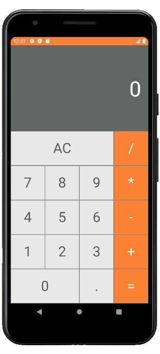

<h4 align="center">
  Projeto Calculadora
</h4>

 

  

## :rocket: Tecnologias

Esse projeto foi desenvolvido com as seguintes tecnologias:

- [React Native](https://facebook.github.io/react-native/)
- [Styled Components](https://styled-components.com/)

## 💻 Projeto

Projeto inspirado na calculadora do macOS

  

